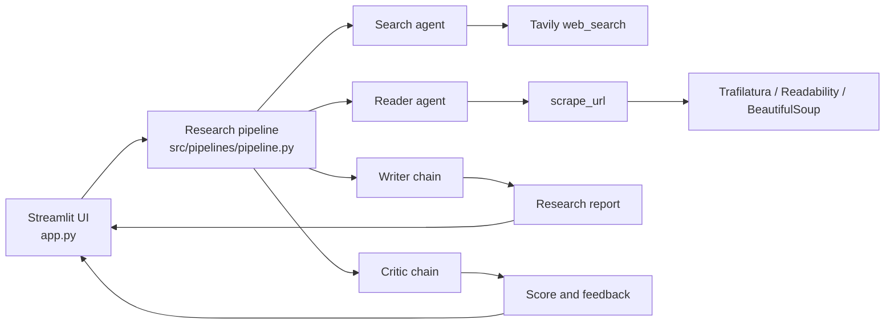

# AI Research Agent

An agentic research application built with Streamlit, LangChain, Groq, and Tavily. Enter a research topic and the app searches the web, selects and scrapes one relevant source, writes a structured report, and asks a critic agent to review the result.

## Features

- Web search for recent information using Tavily.
- Automatic selection and extraction of one relevant source page.
- Structured report generation with an LLM hosted by Groq.
- Critic review with a score, strengths, improvement areas, and verdict.
- Search results, selected source, scraped content, report, and critic output in one UI.
- Download the final report as Markdown or plain text.

## Architecture



The pipeline runs sequentially:

1. **Search agent** calls `web_search` and returns up to five results with titles, URLs, and snippets.
2. **Reader agent** chooses exactly one URL and calls `scrape_url`.
3. **Writer chain** combines the search results and scraped source into an introduction, key findings, conclusion, and sources.
4. **Critic chain** evaluates the report using a `Score: X/10` format and provides structured feedback.

## Tools and components

| Component | Location | Purpose |
| --- | --- | --- |
| `web_search` | `src/tools/tools.py` | Queries Tavily and formats titles, URLs, and snippets. |
| `scrape_url` | `src/tools/tools.py` | Fetches one URL and extracts readable text. It tries Trafilatura first, then Readability, then a BeautifulSoup fallback. |
| Search agent | `src/agents/agents.py` | Uses the search tool to find relevant sources and preserve their URLs. |
| Scrape agent | `src/agents/agents.py` | Uses the scrape tool on one selected source. |
| Writer chain | `src/agents/agents.py` | Produces the final research report from gathered evidence. |
| Critic chain | `src/agents/agents.py` | Reviews the report and returns a score and feedback. |
| Research pipeline | `src/pipelines/pipeline.py` | Orchestrates the four stages and returns their outputs. |
| Streamlit interface | `app.py` | Collects the topic, runs the pipeline, renders results, and provides downloads. |

## Project structure

```text
.
├── app.py
├── requirement.txt
└── src/
	├── agents/agents.py       # LangChain agents and LLM chains
	├── pipelines/pipeline.py  # Search -> scrape -> write -> critique
	└── tools/tools.py         # Tavily search and URL extraction tools
```

## Requirements

- Python 3.11 or newer is recommended.
- A [Groq API key](https://console.groq.com/keys).
- A [Tavily API key](https://app.tavily.com/).
- Network access for the Tavily search and source-page scraping steps.

## Setup

From the project directory:

```bash
python3 -m venv .venv
source .venv/bin/activate
python -m pip install -r requirement.txt
```

Create a `.env` file in the project root:

```dotenv
GROQ_API_KEY=your_groq_api_key
TAVILY_API_KEY=your_tavily_api_key
```

Keep `.env` private. It is already listed in `.gitignore`; never commit real API keys or place them in the README.

## Run the app

With the virtual environment activated:

```bash
streamlit run app.py
```

Streamlit will print a local URL, usually `http://localhost:8501`.

## How to use it

1. Open the Streamlit URL in a browser.
2. Enter a focused research topic, for example `Impact of AI on the global job market in 2026`.
3. Select **Start Research**.
4. Wait for the Search, Reader, Writer, and Critic stages to complete.
5. Review the search results and selected source.
6. Read the generated report and critic review.
7. Use **Download Markdown** or **Download TXT** to save the report.

The topic and latest result are kept in Streamlit session state for the current browser session. Starting another task replaces the previous result.

## Configuration and behavior

- The configured chat model is `openai/gpt-oss-120b` through `ChatGroq`.
- The LLM temperature is `0.7`.
- Tavily is asked for a maximum of five search results.
- Only one source URL is scraped per research run.
- Extracted page content is limited to 5,000 characters before it is passed onward.
- The critic score is parsed from text matching formats such as `Score: 8/10`.

## Troubleshooting

- **Authentication errors:** confirm both API keys exist in `.env`, then restart Streamlit.
- **Search failures:** check the Tavily account, API quota, and network connection.
- **Scraping failures:** some sites block automated requests or require JavaScript; try another topic or source.
- **Import errors:** activate `.venv` and run `python -m pip install -r requirement.txt` again.

## Security note

API keys are loaded with `python-dotenv` and must remain outside version control. If a key is ever exposed, revoke it and create a replacement immediately.